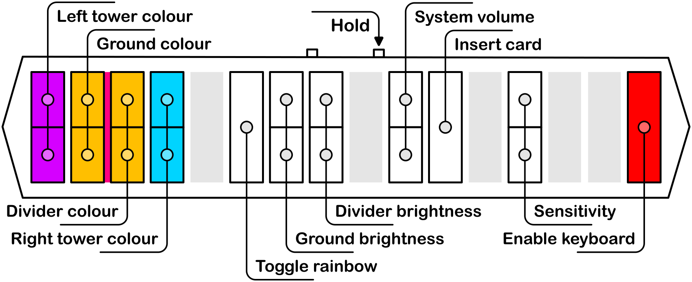
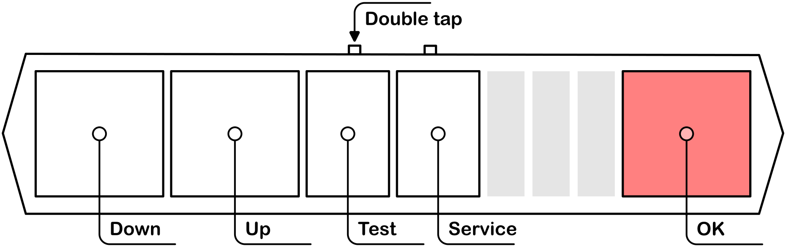
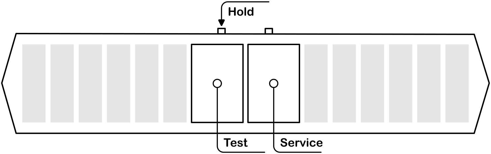

# TASOLLER Custom Firmware (Host MCU - Application ROM)

See [Development](./Development.md) for development information.

Like what you see? [Buy me a coffee](https://ko-fi.com/bottersnike)

## Features
- Superior slider processing; no more dropped holds or missed notes!
- Native arcade IO support
- Air sensor anti-jitter (fixes dodgy sensors)
- Intuitive menus
- Arcade-accurate colours

And of course, it's all open source :).

## Setup
### Installing Firmware
- Download both `host_aprom.bin` and `led_aprom.bin`
- Run `TASOLLER-FirmwareUpdater.exe`
- Follow the instructions

### Configuring segatools
This firmware emulates arcade IO. As such, segatools' emulation should be disabled, by adding the following lines:

```ini
[slider]
enable=0
[io4]
enable=0
```

Ensure no other `[slider]` section exists in the file (or if it does, set `enable=0` there instead).

The slider **MUST** be assigned to port `COM1`. To do this:

- Go to `Devices and Printers` in control panel
- Double click `TASOLLER`
- In the `Hardware` tab, double click `USB Serial Device`
  - If this already reads `USB Serial Device (COM1)` nothing needs done
- Click `Change settings`
- Go to `Port Settings` -> `Advanced...`
- Under the dropdown for `COM Port Number:` select `COM1`

If `COM1` is already in use, check what device it is assigned to in Device Manager under `Ports (COM & LPT)`. You may need to enable `View` -> `Show hidden devices`.

Pre-chusan Chunithm uses IO3. This firmware does not (and unfortunately cannot) support IO3. It is recommended to enable the HID keyboard mode, and continue to use keyboard input for IRs.

## Controls
### General
Tap FN1 to insert a coin. FN2 is currently unbound.

### Configuration
While holding FN1, the following configuration options are available:



※ "Insert card" will hold the Enter key for 5 seconds

### Test menu

To enter the system test menu, double-tap FN2. This will mirror the on-screen controls, and additionally adds controls for the TEST and SERVICE buttons on a real cabinet. Double-tap FN2 again to leave this mode on the controller (note that this is not synced with the game exiting the menu!).



To access the TEST and SERVICE buttons without entering the test menu, hold FN2 instead.



## Keyboard Mapping
When the HID keyboard is enabled, the following mapping (UMIGURI defaults) is used:


with the airs mapped as `0OLP,.`.

Please note that this is slightly different to stock firmware!
